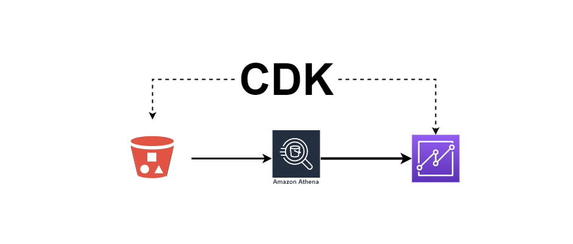

# Building QuickSight Datasets with CDK - S3


This AWS CDK code is a companion for the blog post [Building QuickSight Datasets with CDK - Athena](https://www.aws-blog-de/2022/02/building-quicksight-datasets-with-cdk-athena.html) on how to create Quicksight datasets with CDK using data available in Athena.

The project assumes [Python3](https://www.python.org/downloads/) and [aws-cdk](https://www.npmjs.com/package/aws-cdk) are available.

Create a virtual environment.
```bash
$ python3 -m venv env
```

Activate the virtual environment.
```bash
$ source env/bin/activate
```

Install python dependencies.
```bash
python -m pip install -r requirements.txt
```

Generate Cloudformation templates.
```bash
QUICKSIGHT_USERNAME="your-quicksight-username" BUCKET_NAME="your-bucket-name" cdk synth
```

Deploy stacks.
```bash
QUICKSIGHT_USERNAME="your-quicksight-username" BUCKET_NAME="your-bucket-name" cdk deploy athenatitanic
```