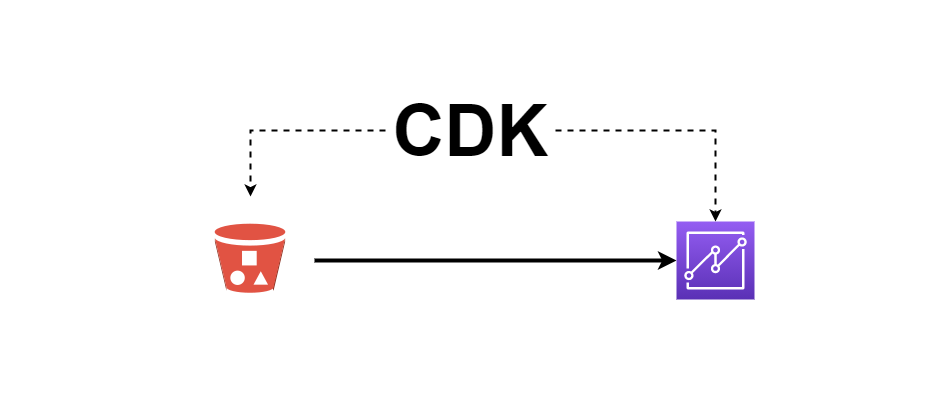

# Building QuickSight Datasets with CDK - S3


This AWS CDK code is a companion for the blog post [Building QuickSight Datasets with CDK - S3](https://www.aws-blog.de/2021/09/building-quicksight-datasets-with-cdk-s3.html) on how to create Quicksight datasets with CDK using data available in S3.

The project assumes [Python3](https://www.python.org/downloads/) and [CDK@next](https://www.npmjs.com/package/aws-cdk) are available.

Create a virtual environment.
```bash
$ python3 -m venv env
```

Activate the virtual environment.
```bash
$ source env/bin/activate
```

Install python dependencies.
```bash
python -m pip install -r requirements.txt
```

[Bootstrap CDK in your account/region](https://docs.aws.amazon.com/cdk/v2/guide/bootstrapping.html) in case you didn't do it yet.
```bash
cdk bootstrap
```

Generate Cloudformation templates.
```bash
QUICKSIGHT_USERNAME="your-quicksight-username" BUCKET_NAME="your-bucket-name" cdk synth
```

Deploy stacks.
```bash
QUICKSIGHT_USERNAME="your-quicksight-username" BUCKET_NAME="your-bucket-name" cdk deploy s3titanic
```