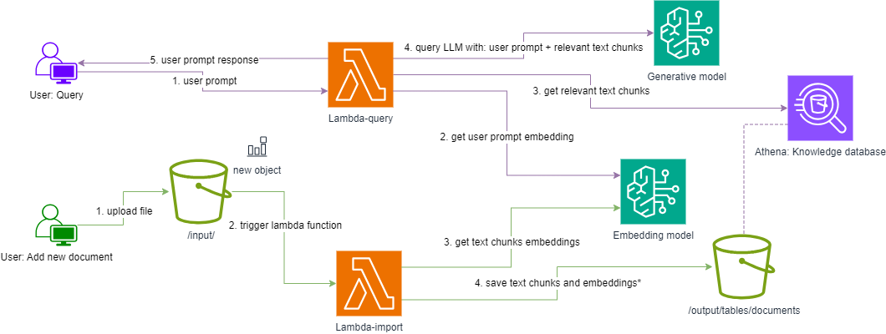

# Low-cost serverless RAG


This folder contain IaC to create a low-cost serverless RAG solution based on Athena, Lambda, S3 and Bedrock.
More information about the solution is available [in this blog article](https://www.tecracer.com/blog/2024/08/building-a-low-cost-serverless-retrieval-augmented-generation-rag-solution.html).


The project assumes [Python3](https://www.python.org/downloads/) is available with [pip](https://pip.pypa.io/en/stable/installation/) as well as the [AWS CDK Toolkit](https://www.npmjs.com/package/aws-cdk).

Create a virtual environment.
```bash
$ python3 -m venv env
```

Activate the virtual environment.
```bash
$ source env/bin/activate
```

Install python dependencies.
```bash
python -m pip install -r requirements.txt
```

Test the stack
```
cdk synth
cfn-lint cdk.out/*.template.json -i W3005
```

You environment should contain proper AWS credentials for the deployment to take place.

Deploy the resources.
```bash
cdk deploy
```

The output contains the S3 import folder where documents should be uploaded to be added to the knowledge database as well as the name of the Lambda function to query the RAG system.
```bash
Outputs:
LowCostServerlessRAGStack.DocumentImportFolder = s3://lowcostserverlessragstack-rag70e8-pr5zms/input/
LowCostServerlessRAGStack.LambdaQueryName = LowCostServerlessRAGStack-RAGDocumentQuery415C-MUeyZye
```


The system can be queried with the following snippet after replacing `NAME_OF_THE_QUERY_LAMBDA_FUNCTION` with the proper value.
```bash
aws lambda invoke --invocation-type RequestResponse --cli-binary-format raw-in-base64-out --function-name NAME_OF_THE_QUERY_LAMBDA_FUNCTION --payload '{"query": "Tell me the story about the ugly prince"}' output.txt
```

To test the system, you may download and upload this [betime-stories file](http://en.copian.ca/library/learning/bedtime/bedtime.pdf) file into the knowledge database and run the previous query once again.
